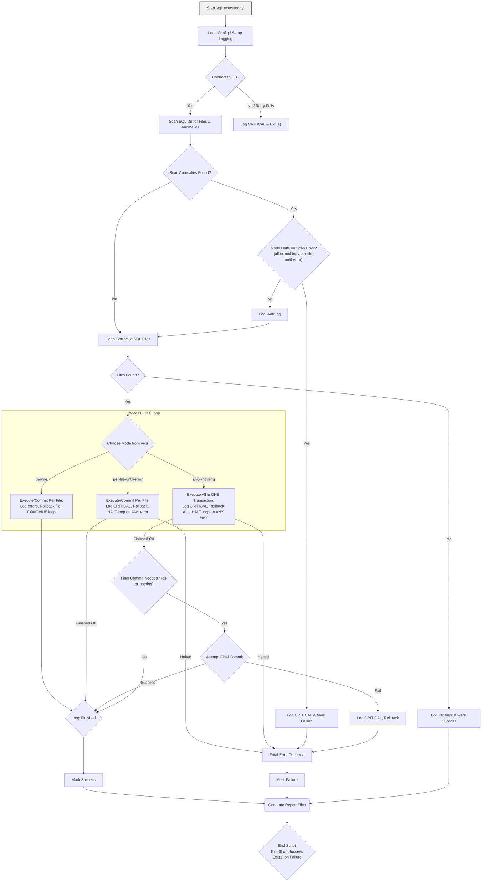
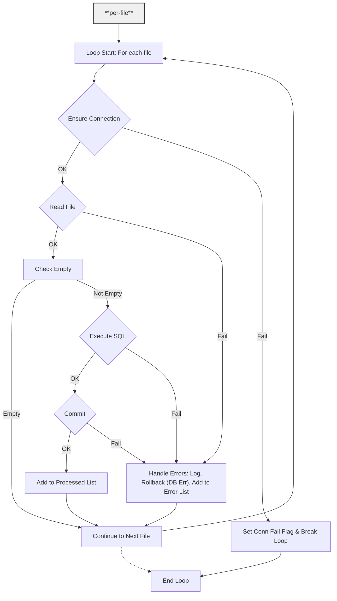
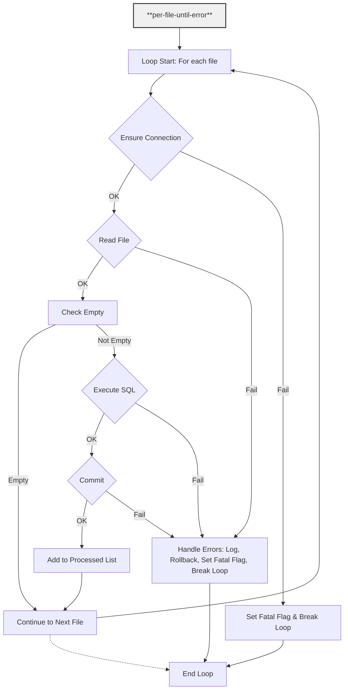
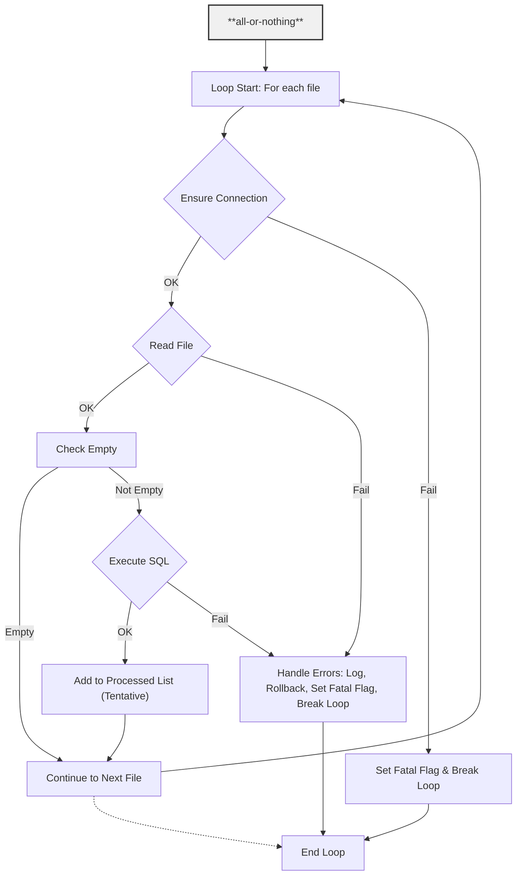

# SQL Script Executor for PostgreSQL

This Python script automates the execution of SQL scripts from a specified directory against a PostgreSQL database. It offers robust logging, comprehensive error handling, and flexible transaction control, making it suitable for setup procedures or batch SQL operations.

## Table of Contents

1.  [Overview](#overview)
2.  [Features](#features)
3.  [Prerequisites](#prerequisites)
6.  [Preparation](#preparation)
    * [Database Connection](#database-connection)
    * [Target SQL Scripts Directory](#target-sql-scripts-directory)
5.  [Installation](#installation)
6.  [Usage](#usage)
    * [Command-Line Arguments](#command-line-arguments)
    * [Examples](#examples)
7.  [Transaction Modes in Detail](#transaction-modes-in-detail)
8.  [Logging and Reporting](#logging-and-reporting)
9.  [Error Handling](#error-handling)
10. [Default Directory Structure](#default-directory-structure)
11. [Workflow Diagrams](#workflow-diagrams)
    * [Overall Workflow](#overall-workflow)
    * [Individual Modes](#individual-modes):
        [`per-file`](#per-file),
        [`per-file-until-error`](#per-file-until-error),
        [`all-or-nothing`](#all-or-nothing).

## Overview

This script connects to a PostgreSQL database and executes all `.sql` files found within a designated directory, recursively. Files are processed in a natural sort order (e.g., `1_script.sql`, `2_script.sql`, `10_script.sql`)  following the directory tree for predictable script execution sequence. The script provides three transaction handling modes to accommodate various deployment scenarios, from simple script sequences to complex, atomic database updates. There is an accompanying script to preview the sort order before processing.

## Features

* **Automated SQL Execution:** `sql_executor.py` executes/commits multiple `.sql` files in a naturally sorted order.
* **Preview sorting order:** The script **`sorted_sql_paths.py`** previews and logs all `.sql` files found **sorted, but with no further action**. It also logs a list of file anomalies found. Useful to assert processing order and file access.
* **PostgreSQL Compatibility:** Specifically designed for PostgreSQL database interactions.
* **Flexible Transaction Control:**
    * `per-file`: Each script is commited in a separate transaction. Errors are skipped.
    * `per-file-until-error`: Each script is commited in a separate transaction, halting execution on the first encountered error.
    * `all-or-nothing`: All scripts are commited within a single transaction; any failure results in a complete rollback.
* **Robust Database Connection:**
    * Implements retry logic for initial database connection attempts.
    * Operates with `autocommit = FALSE` to ensure explicit transaction management.
* **Intelligent File Discovery:**
    * Recursively locates `.sql` files within the target directory.
    * Supports symbolic links.
    * Identifies and reports file access issues or path anomalies (e.g., broken symbolic links, non-regular files).
* **Comprehensive Logging:**
    * Outputs logs to both the console and a dedicated log file (`./logs/sql_executor.log`).
    * Includes detailed timestamps, log levels, and source module information.
    * Generates timestamped report files in the `./logs` directory, detailing:
        * Successfully committed/executed scripts.
        * Scripts that caused errors.
        * Empty script files.
        * File scanning anomalies.
        * Unprocessed scripts (if execution halted early).
* **Configuration via Environment Variables or `.env` File:** Facilitates setting up database connection parameters.
* **Command-Line Interface:** Provides a clear CLI for script operation.

## Prerequisites

* **Python 3.x:** The script is developed for current Python 3 versions.
* **PostgreSQL Server:** A running PostgreSQL instance is required for database operations.
* **Required Python Libraries:**
    * `psycopg2-binary`: PostgreSQL adapter for Python.
    * `python-dotenv`: For loading environment variables from `.env` files.
    * `natsort`: For natural sorting of filenames.

## Preparation

### Database Connection

The script utilizes environment variables for PostgreSQL connection parameters. These can be set as environment variables or defined in a `.env` file located in the script's project directory. The defaults given below are the same used in the official PostgreSQL Docker image. **Note:** Environment variables will override values specified in an `.env` file.

* `DB_NAME`: The target database name (default: `postgres`).
* `DB_USER`: The database username (default: `postgres`).
* `DB_PASS`: The database user's passphrase (default: `mysecretpassword` - **it is strongly recommended to change this for any non-development environment**).
* `DB_HOST`: The database server hostname or IP address (default: `localhost`).
* `DB_PORT`: The port number for the database server (default: `5432`).

**Example `.env` file:**
```env
DB_NAME="production_db"
DB_USER="deploy_user"
DB_PASS="not a weak passphrase"
DB_HOST="db.example.com"
DB_PORT=5432
```


### Target SQL Scripts Directory

By default, the script targets `../` as the source for SQL files ([see diagram](#default-directory-structure)). For instance, if the script's path is `~/some_dir/sql_files/<project-directory>/sql_executor.py`, then `sql_executor.py` will process all SQL scripts inside `sql_files`, recursively. Alternatively, the path to the SQL scripts' top directory can be passed to this script via the `--sql-dir` (or simply `-d`) command-line argument.

* In any case, logs are saved to `<project-directory>/logs/<timestamp>/`.

* The default approach processes all target SQL scripts by simply installing and running this project's directory inside the top SQL scripts' directory. Logging would be isolated for each batch of SQL scripts.

 * The approach of passing the SQL directory to the script allows installation anywhere. Logs would be centralized in the same directory for any batches of SQL files processed from the same installation.


## Installation

1.  **Obtain the Script:**
    Clone the repository containing the script, or save the script files to a directory, according to your [preferred approach](#target-sql-scripts-directory) (e.g., `~/sql_files/<project directory>/` if using the default approach).

2.  **Establish a Virtual Environment (Optional-Recommended):**
    Navigate to your project directory and create a dedicated virtual environment.

    * **With Python's standard `venv`:**
        ```bash
        # Create the environment
        cd <path_to_project_directory>
        python -m venv <environment_name>

        # Activate it according to your system:
        source <environment_name>/bin/activate  # For Linux/macOS
        <environment_name>\Scripts\activate  # For Windows
        ```
    * **Or with Conda:**
        ```bash
        conda create -n <environment_name>
        conda activate <environment_name>
        ```

3.  **Install Dependencies:**
    Use the provided `requirements.txt`, or create the file in your project root with the following content:
    ```txt
    psycopg2-binary
    python-dotenv
    natsort
    ```
    Install dependencies using a package manager of your choice:
    ```bash
    pip install -r requirements.txt
    ```
    ```bash
    conda install --file requirements.txt
    ```

## Usage

Execute the scripts `sql_executor.py` and `sorted_sql_paths.py` from the command line.

### Command-Line Arguments

* #### **For `sorted_sql_paths.py`**

    ```bash
    # Long version
    python sorted_sql_paths.py [--sql-dir <PATH_TO_SQL_FILES>]

    # Short version
    python sorted_sql_paths.py [-d <PATH_TO_SQL_FILES>]
    ```
  * **`--sql-dir` (short version `-d`) (Optional):** Specifies the path to the directory containing `.sql` files. Defaults to `../` if not provided.

* #### **For `sql_executor.py`**

    ```bash
    # Long version
    python sql_executor.py --transaction-mode <MODE> [--sql-dir <PATH_TO_SQL_FILES>]

    # Short version
    python sql_executor.py -t <MODE> [-d <PATH_TO_SQL_FILES>]
    ```

  * **`--transaction-mode` (short version `-t`) (Required):** Defines the transaction handling strategy.
    * `per-file`: Each script is committed individually. Database errors lead to a rollback for that specific script, and execution proceeds to the next. File read errors result in skipping the problematic file.
    * `all-or-nothing`: All scripts are processed within a single transaction. This transaction is committed only if all scripts (and pre-execution file checks) complete without error. Any failure at any stage triggers a full rollback and halts processing.
    * `per-file-until-error`: Each script is committed individually. However, processing halts upon the first error encountered (scan, file, or database). A rollback is attempted for the script that caused the error.

    You can find more details [below](#transaction-modes-in-detail).

  * **`--sql-dir` (short version `-d`) (Optional):** Specifies the path to the directory containing `.sql` files. Defaults to `../` if not provided.

### Examples

1.  **Preview sorting order for scripts in `../sql_files`:**
    ```bash
    python sorted_sql_paths.py
    ```

2.  **Execute scripts in `all-or-nothing` mode from `./database/migrations`:**
    ```bash
    python sql_executor.py -t all-or-nothing -d ./database/migrations
    ```

3.  **Execute scripts in `per-file-until-error` mode from a directory named `deployment_scripts`:**
    ```bash
    python sql_executor.py -t per-file-until-error --sql-dir deployment_scripts
    ```

## Transaction Modes in Detail

Selecting the appropriate transaction mode is critical for ensuring data integrity and predictable deployment outcomes.

* **`per-file`**:
    * **Use Case:** Suitable when SQL scripts are largely independent, and the failure of one should not impede the execution of others (e.g., applying multiple, discrete patches or minor updates).
    * **Advantages:** Maximizes the number of scripts applied when some contain errors.
    * **Considerations:** May result in a partially modified database state if errors occur. Requires diligent log review.

* **`per-file-until-error`**:
    * **Use Case:** Appropriate for incremental updates where each step is a prerequisite for the next, but successful preceding steps should be committed. Useful during development or for quickly identifying the initial point of failure in a sequence.
    * **Advantages:** Commits completed work up to the point of failure. Facilitates pinpointing the problematic script.
    * **Considerations:** An error occurring mid-sequence will result in a partially updated database.

* **`all-or-nothing`**:
    * **Use Case:** Essential for critical deployments where atomicity and database consistency are paramount (e.g., complex schema migrations, large-scale data transformations that must fully complete or not at all).
    * **Advantages:** Guarantees the database is either fully updated or remains unchanged if any error occurs. Simplifies rollback scenarios.
    * **Considerations:** A single error in any script, or even a pre-execution file access issue, will prevent all changes. May have longer execution times for extensive script sets as the commit occurs only at the end.

## Logging and Reporting

The script provides extensive logging for traceability and audit purposes.

* **Console Logging:** Provides real-time operational feedback.
* **File Logging (`./logs/<timestamp>/all_logs_sql_executor_<timestamp>.log`):** Maintains a persistent record of all operations. The `logs` directory is automatically created if it does not exist.
    * Log Format: `YYYY-MM-DD HH:MM:SS - LEVEL - [module:lineno] - message`
* **Execution Report Files:** Post-execution log files are generated in the `./logs/<timestamp>/` directory, categorized by outcome:
    * `files_found.log` lists all accessible `.sql` files found.
    * `file_anomalies.log`: Reports paths identified as `.sql` files but were inaccessible, broken links, or not regular files.
    * `committed_files.log` (or `executable_files.log` if mode `all-or-nothing` failed): Lists scripts successfully included in a commit (or those that would have been, prior to a global rollback).
    * `errors.log`: Details scripts that encountered errors during processing or execution.
    * `empty_files.log`: Identifies `.sql` files that were found but contained no executable content. These files don't raise an error.
    * `unprocessed_files.log`: Lists scripts found but not attempted due to an earlier fatal error halting execution (primarily relevant for `all-or-nothing` and `per-file-until-error` modes).

These reports serve as valuable resources for auditing deployment processes and troubleshooting issues.

## Error Handling

The script incorporates mechanisms to manage various error conditions:

* **Connection Errors:** Attempts to reconnect to the database with a retry mechanism. Persistent failure to connect will terminate execution.
* **File System Errors:**
    * Failure to create the log directory disables file logging but permits console logging.
    * Issues accessing or reading `.sql` files are logged.
    * In `all-or-nothing` and `per-file-until-error` modes, file scanning anomalies or read errors are considered fatal and will halt execution. In `per-file` mode, such files are skipped.
* **SQL Execution Errors:**
    * `psycopg2.Error` exceptions are caught and handled.
    * Error details, including `SQLSTATE` and `pgerror`, are logged.
    * Rollback procedures are initiated according to the selected transaction mode.
* **Commit Errors:** Treated similarly to SQL execution errors, with appropriate rollback attempts.
* **Unexpected Errors:** A global exception handler logs other unforeseen issues to aid in diagnostics.

The script endeavors to ensure the database connection is properly closed and transactions are appropriately managed (committed or rolled back) upon completion or error.

## Default Directory Structure

A typical project layout might be as follows:
```
sql_files/                      # Directory for SQL files
    ├── 1_create_schemas.sql               -┐
    ├── 2_create_tables.sql                 │
    ├── ...                                 │
    ├── 10_seed_initial_data.sql            │
    ├── sub_directory/                      ├── SQL scripts
    │       ├── 1_create_sub_schemas.sql    │
    │       ├── 2_update_tables.sql         │
    │       └── 3_clean_up.sql             -┘
    │
    └── sql-executor/
            ├── sql_executor.py         # Processing script
            ├── sorted_sql_paths.py     # Script to preview sorting
            ├── requirements.txt        # Python dependencies
            ├── .env                    # Optional: for DB credentials
            └── logs/                   # Automatically created for log files
                    │
                    └── <timestamp>/
                            ├── all_logs_sql_executor.log       # Comprehensive log 
                            ├── files_found.log
                            ├── committed_files.log             # Not if `all-or-nothing` fails
                            ├── executable_files.log            # Only if `all-or-nothing` fails
                            ├── unprocessed_files.log
                            ├── empty_files.log
                            ├── errors.log
                            └── anomalies.log
```

## Workflow Diagrams

### Overall workflow


---

### Individual modes

#### `per-file`


---

#### `per-file-until-error`


---

#### `all-or-nothing`

